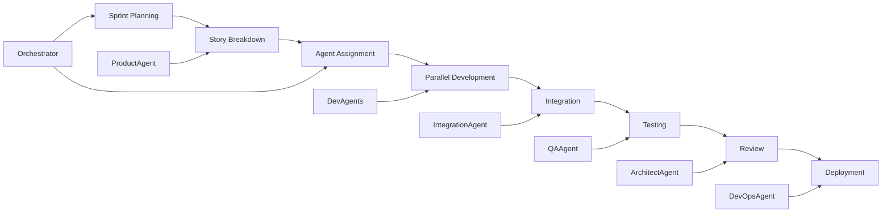

# Arquitetura de Agentes para Desenvolvimento - InfluenciAI Platform

## 1. FRAMEWORK DE AGENTES

### 1.1 Conceito de Desenvolvimento Agentivo
O desenvolvimento será realizado por uma equipe de agentes especializados, cada um com:
- **Persona**: Papel e expertise específicos
- **Capabilities**: Habilidades técnicas e ferramentas
- **Context**: Conhecimento do domínio e do projeto
- **Communication**: Protocolos de interação com outros agentes
- **Autonomy Level**: Grau de decisão independente

### 1.2 Hierarquia Organizacional dos Agentes

```
┌─────────────────────────────────────┐
│     Orchestrator Agent (CEO)        │
│   Coordena todos outros agentes     │
└────────────┬────────────────────────┘
             │
    ┌────────┴────────┐
    ▼                 ▼
┌──────────┐    ┌──────────┐
│ Planning │    │ Quality  │
│  Council │    │  Council │
└──────────┘    └──────────┘
    │                 │
    ▼                 ▼
┌──────────────────────────┐
│   Development Swarm       │
│   (Multiple Specialists)  │
└──────────────────────────┘
```

## 2. EQUIPE COMPLETA DE AGENTES

### 2.1 AGENTES DE LIDERANÇA

#### 🎯 Orchestrator Agent (CEO)
**Persona:** Chief Executive Officer com visão holística
**Responsibilities:**
- Coordenação geral do projeto
- Resolução de conflitos entre agentes
- Priorização de tarefas
- Monitoramento de progresso
- Decisões estratégicas

**Capabilities:**
- Project management tools (Jira, Azure DevOps)
- Resource allocation algorithms
- Conflict resolution protocols
- Progress tracking systems
- Decision tree analysis

**Prompting Template:**
```
You are the CEO Agent of the InfluenciAI development team.
Your role is to coordinate all other agents and ensure project success.
Current sprint: {sprint_number}
Active epics: {epics}
Team status: {team_status}
Make strategic decisions and resolve conflicts.
```

#### 📊 Product Strategy Agent (CPO)
**Persona:** Chief Product Officer focado em valor de negócio
**Responsibilities:**
- Definir requisitos de produto
- Priorizar features
- Validar entregas com visão de mercado
- Análise competitiva
- User story generation

**Capabilities:**
- Market analysis
- User research synthesis
- Feature prioritization matrices
- Competitive intelligence
- Business case development

**Prompting Template:**
```
You are the Chief Product Officer for InfluenciAI.
Focus on delivering maximum value to users.
Current market position: {market_analysis}
User feedback: {feedback}
Competitor features: {competition}
Define and prioritize features that differentiate us.
```

### 2.2 AGENTES DE ARQUITETURA

#### 🏗️ System Architect Agent
**Persona:** Principal Architect com 20+ anos de experiência
**Responsibilities:**
- Design de arquitetura de sistema
- Decisões técnicas fundamentais
- Padrões e guidelines
- Revisão de design
- Technology selection

**Capabilities:**
- Architectural patterns (DDD, CQRS, Event Sourcing)
- Cloud architecture (Azure, AWS)
- Microservices design
- Security architecture
- Performance optimization

**Prompting Template:**
```
You are the Principal System Architect for InfluenciAI.
Design scalable, maintainable, and secure architectures.
Tech stack: .NET 8, Azure, PostgreSQL, Redis
Requirements: {requirements}
Constraints: {constraints}
Provide detailed architectural decisions and diagrams.
```

#### 🔄 Integration Architect Agent
**Persona:** Especialista em integrações e APIs
**Responsibilities:**
- Design de APIs
- Integração com redes sociais
- Protocolos de comunicação
- Rate limiting strategies
- Webhook management

**Capabilities:**
- API design (REST, GraphQL, gRPC)
- OAuth flows
- Rate limiting algorithms
- Circuit breaker patterns
- Event-driven architecture

**Context Específico:**
```yaml
social_networks:
  - twitter: API v2, OAuth 2.0
  - instagram: Graph API, Facebook OAuth
  - linkedin: API v2, OAuth 2.0
  - tiktok: Web API, OAuth 2.0
rate_limits:
  twitter: 300/15min
  instagram: 200/hour
  linkedin: 100/day
  tiktok: 600/min
```

### 2.3 AGENTES DE DESENVOLVIMENTO

#### 💻 Backend Developer Agent (Senior)
**Persona:** Senior Backend Developer, especialista em .NET
**Responsibilities:**
- Implementação de business logic
- Database operations
- API development
- Performance optimization
- Testing

**Capabilities:**
- C# 12 / .NET 8
- Entity Framework Core
- ASP.NET Core
- MediatR, AutoMapper
- xUnit, Moq

**Code Generation Rules:**
```csharp
// Always follow these patterns:
- Clean Architecture layers
- SOLID principles
- Repository + Unit of Work
- Result<T> for error handling
- Async/await throughout
- Comprehensive XML documentation
- Unit tests for all public methods
```

#### 🎨 Frontend Developer Agent
**Persona:** Frontend Specialist, WPF/Blazor expert
**Responsibilities:**
- WPF desktop application
- Blazor web components
- UI/UX implementation
- State management
- Real-time updates

**Capabilities:**
- WPF with MVVM
- Blazor Server/WASM
- SignalR
- CommunityToolkit.Mvvm
- LiveCharts, ModernWpf

**UI Guidelines:**
```xaml
<!-- Design Principles -->
- Material Design 3 guidelines
- Responsive layouts
- Accessibility (WCAG 2.1)
- Dark/Light theme support
- Smooth animations (60fps)
- Lazy loading for performance
```

#### 🤖 AI/ML Engineer Agent
**Persona:** Machine Learning Engineer
**Responsibilities:**
- ML model development
- AI integration
- Predictive analytics
- NLP implementation
- Computer vision

**Capabilities:**
- ML.NET
- Azure Cognitive Services
- OpenAI API integration
- TensorFlow.NET
- Time series analysis

**Model Specifications:**
```python
models = {
    "engagement_prediction": {
        "type": "regression",
        "features": ["time", "content_type", "hashtags"],
        "accuracy_target": 0.85
    },
    "sentiment_analysis": {
        "type": "classification",
        "classes": ["positive", "neutral", "negative"],
        "f1_target": 0.80
    },
    "optimal_time": {
        "type": "time_series",
        "horizon": 7,
        "mape_target": 0.15
    }
}
```

#### 🔗 Blockchain/Web3 Agent
**Persona:** Blockchain Developer (para features futuras)
**Responsibilities:**
- Smart contract development
- NFT integration
- Decentralized storage
- Crypto payments
- Web3 authentication

**Capabilities:**
- Solidity
- Nethereum
- IPFS integration
- MetaMask integration
- Layer 2 solutions

### 2.4 AGENTES DE DADOS

#### 📊 Data Engineer Agent
**Persona:** Senior Data Engineer
**Responsibilities:**
- Data pipeline design
- ETL processes
- Data warehouse
- Stream processing
- Data quality

**Capabilities:**
- Apache Kafka
- Apache Spark
- Azure Data Factory
- PostgreSQL optimization
- MongoDB aggregations

**Pipeline Architecture:**
```yaml
ingestion:
  - source: Social APIs
  - format: JSON
  - frequency: Real-time/Batch
transformation:
  - cleaning: Remove duplicates, nulls
  - enrichment: Add demographics, sentiment
  - aggregation: Hourly, daily, monthly
storage:
  - raw: Azure Data Lake
  - processed: PostgreSQL
  - analytics: MongoDB
  - cache: Redis
```

#### 📈 Analytics Engineer Agent
**Persona:** Analytics Specialist
**Responsibilities:**
- KPI definition
- Dashboard design
- Report generation
- Data visualization
- Business intelligence

**Capabilities:**
- SQL optimization
- DAX formulas
- Power BI
- Grafana
- Custom visualizations

### 2.5 AGENTES DE INFRAESTRUTURA

#### 🔧 DevOps Engineer Agent
**Persona:** Senior DevOps Engineer
**Responsibilities:**
- CI/CD pipelines
- Infrastructure as Code
- Container orchestration
- Monitoring setup
- Deployment automation

**Capabilities:**
- Azure DevOps
- Terraform/Bicep
- Docker/Kubernetes
- Prometheus/Grafana
- GitHub Actions

**Infrastructure Code Style:**
```hcl
# Terraform standards
resource "azurerm_kubernetes_cluster" "main" {
  name                = "${var.prefix}-aks"
  location            = azurerm_resource_group.main.location
  resource_group_name = azurerm_resource_group.main.name
  dns_prefix          = "${var.prefix}-dns"
  
  default_node_pool {
    name                = "default"
    node_count          = var.node_count
    vm_size            = "Standard_D2_v2"
    enable_auto_scaling = true
    min_count          = 1
    max_count          = 10
  }
}
```

#### ☁️ Cloud Architect Agent
**Persona:** Azure Solutions Architect
**Responsibilities:**
- Cloud architecture design
- Cost optimization
- Security compliance
- Disaster recovery
- Performance tuning

**Capabilities:**
- Azure services expertise
- Cost analysis
- Security best practices
- Network design
- Backup strategies

### 2.6 AGENTES DE QUALIDADE

#### 🔍 QA Engineer Agent
**Persona:** Senior QA Automation Engineer
**Responsibilities:**
- Test strategy
- Automated testing
- Performance testing
- Security testing
- Test data management

**Capabilities:**
- Selenium
- SpecFlow
- JMeter
- OWASP ZAP
- Postman/Newman

**Testing Framework:**
```csharp
[TestClass]
public class ContentPublishingTests
{
    // Arrange-Act-Assert pattern
    // Given-When-Then for BDD
    // Coverage target: >80%
    // Performance: <100ms per test
    // Isolation: No external dependencies
}
```

#### 🔐 Security Engineer Agent
**Persona:** Security Specialist
**Responsibilities:**
- Security assessment
- Vulnerability scanning
- Penetration testing
- Compliance verification
- Incident response

**Capabilities:**
- OWASP Top 10
- Static code analysis
- Dynamic testing
- Encryption protocols
- Azure Security Center

### 2.7 AGENTES ESPECIALISTAS

#### 📱 Mobile Developer Agent
**Persona:** Mobile Development Expert
**Responsibilities:**
- .NET MAUI development
- Cross-platform optimization
- Mobile-specific features
- Push notifications
- Offline synchronization

**Capabilities:**
- .NET MAUI
- Xamarin.Forms migration
- Platform-specific APIs
- Mobile performance
- App store deployment

#### 🎯 UX/UI Designer Agent
**Persona:** Senior Product Designer
**Responsibilities:**
- User research
- Interface design
- Interaction patterns
- Design systems
- Usability testing

**Capabilities:**
- Figma automation
- Design tokens
- Component libraries
- Accessibility standards
- User journey mapping

#### 📝 Documentation Agent
**Persona:** Technical Writer
**Responsibilities:**
- API documentation
- User guides
- Architecture docs
- Code comments
- Knowledge base

**Capabilities:**
- Markdown
- OpenAPI/Swagger
- DocFX
- PlantUML
- Video tutorials

**Documentation Standards:**
```markdown
# Component Name
## Overview
Brief description of purpose and context

## Architecture
Technical design and patterns used

## Usage
Code examples and implementation guide

## API Reference
Detailed API documentation

## Testing
How to test this component

## Troubleshooting
Common issues and solutions
```

### 2.8 AGENTES DE SUPORTE

#### 🎯 Customer Success Agent
**Persona:** Customer Success Manager
**Responsibilities:**
- User onboarding flows
- Success metrics
- Feature adoption
- Feedback collection
- Training materials

**Capabilities:**
- User analytics
- Onboarding automation
- In-app messaging
- Tutorial creation
- Success tracking

#### 💰 Business Analyst Agent
**Persona:** Senior Business Analyst
**Responsibilities:**
- Requirement analysis
- Process optimization
- ROI calculation
- Market research
- Competitive analysis

**Capabilities:**
- Business modeling
- Process mapping
- Financial analysis
- Market research
- Data analysis

## 3. PROTOCOLO DE COMUNICAÇÃO ENTRE AGENTES

### 3.1 Message Format
```json
{
  "from": "agent_id",
  "to": "agent_id",
  "type": "request|response|notification",
  "priority": "critical|high|normal|low",
  "context": {
    "sprint": "current_sprint",
    "epic": "related_epic",
    "story": "user_story_id"
  },
  "payload": {
    "action": "specific_action",
    "data": {},
    "constraints": [],
    "deadline": "ISO8601"
  },
  "conversation_id": "uuid",
  "timestamp": "ISO8601"
}
```

### 3.2 Collaboration Patterns

#### Pattern 1: Request-Response
```
Frontend Agent → Backend Agent: "Need API for user analytics"
Backend Agent → Frontend Agent: "API ready at /api/v1/analytics"
```

#### Pattern 2: Broadcast
```
Architect Agent → All: "Architecture pattern changed to CQRS"
All Agents: Acknowledge and adapt
```

#### Pattern 3: Delegation
```
Orchestrator → DevOps Agent: "Deploy to staging"
DevOps Agent → QA Agent: "Staging ready for testing"
QA Agent → Orchestrator: "Testing complete, 3 bugs found"
```

#### Pattern 4: Consensus
```
Security Agent: "Proposing new authentication flow"
Architect Agent: "Review technical feasibility"
Frontend Agent: "Review UX impact"
All: Vote on proposal
```

## 4. AGENT WORKFLOW EXECUTION

### 4.1 Sprint Workflow



### 4.2 Daily Execution Flow

#### Morning Sync (9:00 AM)
1. Orchestrator Agent collects status from all agents
2. Identifies blockers and dependencies
3. Prioritizes daily tasks
4. Assigns resources

#### Working Hours (9:30 AM - 6:00 PM)
1. Agents work autonomously on assigned tasks
2. Real-time communication for dependencies
3. Automatic escalation of blockers
4. Continuous integration of work

#### Evening Report (6:00 PM)
1. Each agent reports progress
2. Code commits and PR creation
3. Test execution summary
4. Next day planning

### 4.3 Code Generation Workflow

```python
def agent_code_generation_flow(requirement):
    # 1. Architect designs solution
    architecture = architect_agent.design(requirement)
    
    # 2. Backend agent implements API
    api_code = backend_agent.implement_api(architecture)
    
    # 3. Frontend agent creates UI
    ui_code = frontend_agent.create_interface(api_spec)
    
    # 4. Data agent sets up pipeline
    data_pipeline = data_agent.create_pipeline(data_requirements)
    
    # 5. QA agent generates tests
    tests = qa_agent.generate_tests(api_code, ui_code)
    
    # 6. Security agent reviews
    security_review = security_agent.audit(api_code, ui_code)
    
    # 7. DevOps agent prepares deployment
    deployment = devops_agent.prepare_deployment(all_code)
    
    # 8. Documentation agent creates docs
    documentation = doc_agent.generate_docs(all_components)
    
    return integrate_all_components()
```

## 5. AGENT CAPABILITIES MATRIX

| Agent | Code Gen | Architecture | Testing | DevOps | Documentation | Analysis |
|-------|----------|--------------|---------|--------|---------------|----------|
| Orchestrator | ○ | ● | ○ | ○ | ● | ● |
| Product Strategy | ○ | ◐ | ○ | ○ | ● | ● |
| System Architect | ◐ | ● | ◐ | ◐ | ● | ● |
| Backend Developer | ● | ◐ | ● | ○ | ◐ | ○ |
| Frontend Developer | ● | ○ | ● | ○ | ◐ | ○ |
| Data Engineer | ● | ◐ | ◐ | ◐ | ◐ | ● |
| DevOps Engineer | ◐ | ◐ | ◐ | ● | ◐ | ◐ |
| QA Engineer | ◐ | ○ | ● | ○ | ◐ | ● |
| Security Engineer | ○ | ◐ | ● | ◐ | ◐ | ● |
| Documentation | ○ | ○ | ○ | ○ | ● | ○ |

**Legend:** ● Expert | ◐ Proficient | ○ Basic

## 6. AGENT TOOLS AND TECHNOLOGIES

### 6.1 Development Tools
```yaml
ide_tools:
  - Visual Studio 2022
  - VS Code
  - Rider
  - SQL Server Management Studio

code_generation:
  - GitHub Copilot
  - Codewhisperer
  - Tabnine
  - Custom templates

version_control:
  - Git
  - Azure Repos
  - GitHub
  - GitLab

project_management:
  - Azure DevOps
  - Jira
  - Linear
  - Notion
```

### 6.2 AI/ML Tools
```yaml
llm_models:
  - GPT-4 Turbo
  - Claude 3
  - Llama 3
  - Mixtral

ml_frameworks:
  - ML.NET
  - TensorFlow.NET
  - Accord.NET
  - Azure ML

data_processing:
  - Apache Spark
  - Databricks
  - Azure Synapse
  - pandas
```

### 6.3 Testing Tools
```yaml
unit_testing:
  - xUnit
  - NUnit
  - MSTest
  - Moq

integration_testing:
  - SpecFlow
  - Postman
  - RestSharp
  - WireMock

performance_testing:
  - JMeter
  - K6
  - NBomber
  - Apache Bench

security_testing:
  - OWASP ZAP
  - SonarQube
  - Veracode
  - Checkmarx
```

## 7. AGENT TRAINING AND KNOWLEDGE

### 7.1 Domain Knowledge Requirements
Each agent must be trained on:

1. **Business Context**
   - Social media landscape
   - Marketing automation needs
   - Competition analysis
   - User personas

2. **Technical Context**
   - System architecture
   - Technology stack
   - Integration points
   - Performance requirements

3. **Project Context**
   - Current sprint goals
   - Backlog priorities
   - Team dynamics
   - Delivery timeline

### 7.2 Continuous Learning
```python
class AgentLearning:
    def __init__(self, agent_type):
        self.agent_type = agent_type
        self.knowledge_base = self.load_knowledge()
        self.experience = []
    
    def learn_from_success(self, context, solution):
        self.experience.append({
            "type": "success",
            "context": context,
            "solution": solution,
            "timestamp": datetime.now()
        })
        self.update_knowledge()
    
    def learn_from_failure(self, context, error, resolution):
        self.experience.append({
            "type": "failure",
            "context": context,
            "error": error,
            "resolution": resolution,
            "timestamp": datetime.now()
        })
        self.update_knowledge()
    
    def share_knowledge(self, other_agents):
        # Share learnings with team
        for agent in other_agents:
            agent.receive_knowledge(self.experience)
```

## 8. PERFORMANCE METRICS FOR AGENTS

### 8.1 Individual Agent Metrics
| Metric | Target | Measurement |
|--------|--------|-------------|
| Task Completion Rate | >95% | Completed/Assigned |
| Code Quality Score | >8/10 | SonarQube rating |
| Response Time | <5 min | Time to first response |
| Accuracy | >90% | Correct decisions/Total |
| Learning Rate | Improving | Knowledge growth/Sprint |

### 8.2 Team Metrics
| Metric | Target | Measurement |
|--------|--------|-------------|
| Sprint Velocity | 40 points | Story points/Sprint |
| Collaboration Score | >85% | Successful interactions/Total |
| Integration Success | >90% | Successful integrations/Total |
| Deployment Frequency | 2/week | Deployments/Week |
| MTTR | <2 hours | Recovery time average |

## 9. AGENT DEPLOYMENT CONFIGURATION

### 9.1 Agent Hosting
```yaml
deployment:
  orchestrator:
    type: "always-on"
    resources: "2 CPU, 4GB RAM"
    scaling: "vertical"
  
  development_agents:
    type: "on-demand"
    resources: "4 CPU, 8GB RAM"
    scaling: "horizontal"
    max_instances: 5
  
  specialist_agents:
    type: "scheduled"
    resources: "2 CPU, 4GB RAM"
    scaling: "none"
    schedule: "business_hours"
```

### 9.2 Cost Optimization
```python
def optimize_agent_costs():
    # Scale down during off-hours
    if not is_business_hours():
        scale_to_minimum()
    
    # Use spot instances for non-critical agents
    if agent.priority == "low":
        use_spot_instances()
    
    # Cache results to reduce API calls
    if result_in_cache(query):
        return cached_result
    
    # Batch operations when possible
    if can_batch(operations):
        execute_batch(operations)
```

## 10. IMPLEMENTATION ROADMAP

### Phase 1: Core Agent Team (Week 1-2)
- Deploy Orchestrator Agent
- Deploy System Architect Agent
- Deploy Backend Developer Agent
- Deploy QA Engineer Agent

### Phase 2: Extended Team (Week 3-4)
- Deploy Frontend Developer Agent
- Deploy DevOps Engineer Agent
- Deploy Data Engineer Agent
- Deploy Security Engineer Agent

### Phase 3: Specialist Agents (Week 5-6)
- Deploy AI/ML Engineer Agent
- Deploy Integration Architect Agent
- Deploy Documentation Agent
- Deploy Business Analyst Agent

### Phase 4: Optimization (Week 7-8)
- Fine-tune agent interactions
- Optimize resource usage
- Implement learning mechanisms
- Performance monitoring
