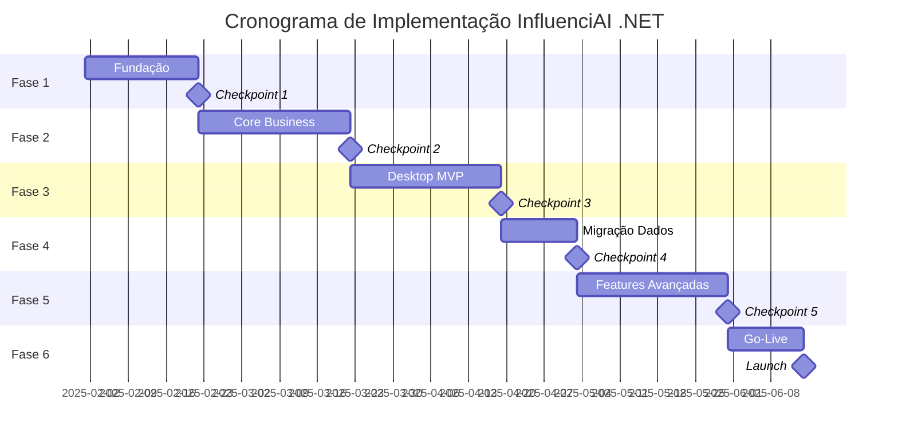

# Plano de Implementação Faseado - InfluenciAI .NET

## 🎯 Visão Geral da Estratégia

### Princípios Norteadores
1. **Migração Incremental** - Não fazer tudo de uma vez
2. **MVP Primeiro** - Funcionalidades core antes de features avançadas
3. **Validação Contínua** - Checkpoints com stakeholders
4. **Risco Controlado** - Manter sistema atual operando durante transição
5. **Modularidade** - Construir componentes reutilizáveis

## 📅 Fase 1: Fundação (3 semanas)

### Objetivos
- Estabelecer estrutura base da solução
- Configurar pipeline CI/CD
- Implementar autenticação básica

### Entregáveis
| Projeto | Tarefas | Estimativa | Critério de Aceite |
|---------|---------|------------|-------------------|
| **Solution Setup** | - Criar estrutura de projetos<br>- Configurar dependências<br>- Setup Docker compose (Postgres + Redis) | 3 dias | Build sem erros |
| **Domain** | - Criar entidades base (User, Analysis)<br>- Value Objects (Email, PostUrl)<br>- Especificações | 2 dias | Testes unitários passando |
| **Infrastructure.Data** | - Configurar EF Core + PostgreSQL<br>- Migration inicial<br>- Repositórios base | 3 dias | CRUD funcionando |
| **Infrastructure.Identity** | - ASP.NET Identity setup<br>- JWT generation<br>- Login/Register endpoints | 4 dias | Autenticação testada |
| **API Gateway** | - Projeto base ASP.NET<br>- Controllers auth<br>- Swagger configurado | 3 dias | API documentada |

### Riscos & Mitigações
- **Risco**: Configuração complexa do Identity
- **Mitigação**: Usar template pronto, ajustar conforme necessário

### Checkpoint 1 ✅
- Demo: Login via API retornando JWT
- Validação: Arquitetura aprovada pelos arquitetos

## 📅 Fase 2: Core Business (4 semanas)

### Objetivos
- Implementar análise de posts
- Integração com X/Twitter API
- Cache Redis funcionando

### Entregáveis
| Projeto | Tarefas | Estimativa | Critério de Aceite |
|---------|---------|------------|-------------------|
| **Application** | - Commands/Queries (CQRS)<br>- DTOs e AutoMapper<br>- Validadores FluentValidation | 4 dias | Casos de uso mapeados |
| **Infrastructure.External** | - TwitterService com Tweetinvi<br>- Mock para desenvolvimento<br>- Rate limiting | 5 dias | Métricas reais do X |
| **Infrastructure.Cache** | - RedisCacheService<br>- Serialização JSON<br>- TTL configurável | 3 dias | Cache hit/miss funcional |
| **Service.Analysis** | - AnalysisOrchestrator<br>- MetricsCalculator<br>- Recommendations (mock) | 5 dias | Análise completa E2E |
| **API Gateway** | - AnalysisController<br>- AdminController (cache)<br>- Error handling | 3 dias | Endpoints testados |

### Riscos & Mitigações
- **Risco**: Rate limiting da API do X
- **Mitigação**: Implementar queue para processar em batch

### Checkpoint 2 ✅
- Demo: Análise completa de um post via Postman
- Validação: Métricas corretas comparadas com sistema atual

## 📅 Fase 3: Cliente Desktop MVP (4 semanas)

### Objetivos
- WPF funcionando com funcionalidades core
- UX básica mas funcional
- Integração completa com API

### Entregáveis
| Projeto | Tarefas | Estimativa | Critério de Aceite |
|---------|---------|------------|-------------------|
| **Desktop.Core** | - Models compartilhados<br>- Helpers e extensions<br>- Base ViewModels | 3 dias | Reusabilidade testada |
| **Desktop.WPF** | - Shell e navegação<br>- LoginView + ViewModel<br>- Secure token storage | 4 dias | Login funcionando |
| **Desktop.WPF** | - DashboardView<br>- Input URL e validação<br>- Binding com commands | 4 dias | Análise iniciada do WPF |
| **Desktop.WPF** | - AnalysisView<br>- MetricCards<br>- Charts (LiveCharts2) | 5 dias | Visualização de dados |
| **Desktop.WPF** | - HistoryView<br>- Lista paginada<br>- Detalhamento | 3 dias | Histórico navegável |
| **Desktop.WPF** | - Temas (ModernWPF)<br>- Ícones e assets<br>- Responsividade | 3 dias | UI polida |

### Riscos & Mitigações
- **Risco**: Complexidade do MVVM para time não familiar
- **Mitigação**: Workshop interno, pair programming

### Checkpoint 3 ✅
- Demo: Fluxo completo no WPF (login → análise → visualização)
- Validação: Teste com 5 usuários beta

## 📅 Fase 4: Migração de Dados (2 semanas)

### Objetivos
- Migrar dados do SQLite para PostgreSQL
- Manter integridade e histórico
- Zero downtime

### Entregáveis
| Projeto | Tarefas | Estimativa | Critério de Aceite |
|---------|---------|------------|-------------------|
| **DataMigration Tool** | - Export SQLite para JSON<br>- Validação de dados<br>- Relatório de problemas | 3 dias | Dados exportados |
| **DataSeeder** | - Import para PostgreSQL<br>- Conversão de tipos<br>- Validação pós-import | 3 dias | Integridade validada |
| **Password Migration** | - Estratégia bcrypt→Identity<br>- Fallback authentication<br>- User notification | 2 dias | Logins funcionando |
| **Validation** | - Queries comparativas<br>- Smoke tests<br>- Rollback plan | 2 dias | Dados conferidos |

### Riscos & Mitigações
- **Risco**: Perda de dados na migração
- **Mitigação**: Backups múltiplos, migração em staging primeiro

### Checkpoint 4 ✅
- Demo: Dados históricos no novo sistema
- Validação: Auditoria de integridade

## 📅 Fase 5: Features Avançadas (4 semanas)

### Objetivos
- GraphQL funcionando
- OAuth externo
- Observabilidade

### Entregáveis
| Projeto | Tarefas | Estimativa | Critério de Aceite |
|---------|---------|------------|-------------------|
| **GraphQL** | - HotChocolate setup<br>- Schema v1<br>- Versionamento por header | 5 dias | Playground funcionando |
| **OAuth Integration** | - Google provider<br>- GitHub provider<br>- WPF WebView flow | 5 dias | SSO funcionando |
| **Logging** | - Serilog setup<br>- Structured logging<br>- Seq/AppInsights | 3 dias | Logs centralizados |
| **Monitoring** | - Health checks<br>- Metrics (Prometheus)<br>- Dashboards | 3 dias | Observabilidade ativa |
| **Service.Reporting** | - Report templates<br>- Export (PDF/Excel)<br>- Scheduling | 4 dias | Relatórios gerados |

### Riscos & Mitigações
- **Risco**: OAuth em desktop é complexo
- **Mitigação**: Considerar IdentityServer ou Auth0

### Checkpoint 5 ✅
- Demo: GraphQL queries, OAuth login, dashboard de métricas
- Validação: Requisitos não-funcionais atendidos

## 📅 Fase 6: Produção & Go-Live (2 semanas)

### Objetivos
- Deploy em produção
- Cutover do sistema antigo
- Monitoramento pós-launch

### Entregáveis
| Projeto | Tarefas | Estimativa | Critério de Aceite |
|---------|---------|------------|-------------------|
| **Infrastructure** | - Azure/AWS setup<br>- Networking e segurança<br>- Certificados SSL | 3 dias | Infra provisionada |
| **Deployment** | - CI/CD pipelines<br>- Blue-green deploy<br>- Rollback strategy | 2 dias | Deploy automatizado |
| **WPF Distribution** | - Code signing<br>- MSIX packaging<br>- Auto-updater | 2 dias | Instalador assinado |
| **Documentation** | - User guides<br>- API docs<br>- Runbooks | 2 dias | Docs completos |
| **Go-Live** | - Migração final<br>- Smoke tests<br>- Monitoring | 1 dia | Sistema no ar |

### Riscos & Mitigações
- **Risco**: Problemas no go-live
- **Mitigação**: Dry-run em staging, equipe de plantão

### Checkpoint 6 ✅
- Demo: Sistema em produção
- Validação: KPIs monitorados por 1 semana

## 📊 Cronograma Consolidado



## 🎯 Métricas de Sucesso

### KPIs Técnicos
- ✅ Tempo de resposta `/analyze` < 5s (P95)
- ✅ Disponibilidade > 99.5%
- ✅ Cobertura de testes > 70%
- ✅ Zero vulnerabilidades críticas

### KPIs de Negócio
- ✅ Migração de 100% dos usuários
- ✅ NPS > 45 pós-migração
- ✅ Redução de 60% no tempo de análise manual
- ✅ Conversão trial→pago > 12%

## 🚨 Plano de Contingência

### Cenários de Rollback
1. **Falha crítica em produção**
   - Manter sistema antigo em standby por 30 dias
   - DNS switch em < 5 minutos

2. **Performance degradada**
   - Escalar horizontalmente (já preparado)
   - Cache mais agressivo temporariamente

3. **Problemas de adoção**
   - Suporte dedicado primeira semana
   - Vídeos tutoriais e documentação

## 📝 Decisões Arquiteturais Chave (ADRs)

| Decisão | Justificativa | Alternativas Consideradas |
|---------|--------------|-------------------------|
| **CQRS com MediatR** | Separação clara de comandos/queries | Repository pattern simples |
| **PostgreSQL** | Escalabilidade, features avançadas | SQL Server (custo), MongoDB |
| **WPF vs MAUI** | Maturidade, tooling superior | MAUI ainda instável para desktop |
| **HotChocolate GraphQL** | Melhor integração .NET | GraphQL.NET (menos features) |
| **Microserviços futuros** | Preparar para escala | Monolito modulado suficiente agora |

## 🔄 Processo de Desenvolvimento

### Git Flow
```
main
  └── develop
       ├── feature/fase-1-foundation
       ├── feature/fase-2-core
       └── feature/fase-3-desktop
```

### Code Review
- PR obrigatório para develop/main
- Mínimo 2 aprovações
- Testes automáticos passando
- SonarQube quality gate

### Definition of Done
- [ ] Código revisado
- [ ] Testes unitários (>80% coverage)
- [ ] Testes de integração
- [ ] Documentação atualizada
- [ ] Sem dívida técnica crítica
- [ ] Performance validada

## 👥 Estrutura do Time

### Squads Sugeridos
1. **Squad Platform** (3 devs)
   - Foco: Infrastructure, DevOps, Observability

2. **Squad Backend** (4 devs)
   - Foco: Domain, Application, Services

3. **Squad Desktop** (3 devs)
   - Foco: WPF, UX, Integration

4. **Squad Data** (2 devs)
   - Foco: Migration, Analytics, AI

### Papéis Essenciais
- **Tech Lead**: Decisões arquiteturais
- **Scrum Master**: Facilitação e impedimentos
- **QA Lead**: Estratégia de testes
- **DevOps**: Pipeline e infraestrutura
- **UX Designer**: Experiência desktop
