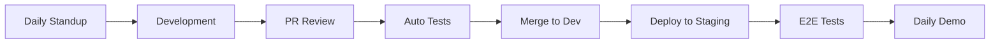

# Roadmap de Implementação Modular - InfluenciAI Platform

## 🎯 Estratégia de Desenvolvimento: Build → Integrate → Scale

### Princípios Fundamentais
1. **Independência**: Cada área pode ser desenvolvida em paralelo
2. **Contratos Claros**: APIs bem definidas entre áreas
3. **MVP Incremental**: Começar com 1 rede social, expandir gradualmente
4. **Feedback Rápido**: Cliente básico funcionando desde a Sprint 2

## 📅 Phase 0: Foundation (2 semanas)

### Objetivo
Estabelecer base técnica e contratos entre módulos

### Entregáveis
```csharp
// Shared.Contracts - Definir TODOS os contratos primeiro
public interface IContent
{
    Guid Id { get; }
    string Text { get; }
    List<IMedia> Media { get; }
    Dictionary<string, object> NetworkSpecificData { get; }
}

public interface INetworkMetrics
{
    int Impressions { get; }
    int Engagements { get; }
    Dictionary<string, object> NetworkSpecificMetrics { get; }
}

public interface IAnalysisResult
{
    MetricsSummary Summary { get; }
    List<Insight> Insights { get; }
    List<Recommendation> Recommendations { get; }
}
```

### Squad Allocation
- **Squad A**: Infrastructure contracts
- **Squad B**: Analysis contracts  
- **Squad C**: Client contracts
- **Todos**: Review e aprovação dos contratos

## 📅 Sprint 1-2: Vertical Slice - Twitter Only (4 semanas)

### Meta
Um fluxo completo funcionando com Twitter: Post → Collect → Analyze → Display

### Infrastructure Team
```csharp
// Semana 1-2: Publisher básico
public class TwitterPublisher : INetworkPublisher
{
    public async Task<PublishResult> PublishAsync(Content content)
    {
        // MVP: Apenas texto
        // Futuro: Imagens, threads, polls
    }
}

// Semana 3-4: Collector básico
public class TwitterCollector : INetworkCollector
{
    public async Task<NetworkMetrics> CollectMetricsAsync(string postId)
    {
        // MVP: Métricas básicas
        // Futuro: Menções, sentiment, reach
    }
}
```

### Analysis Team
```csharp
// Semana 1-2: Engine básico
public class BasicAnalysisEngine
{
    public AnalysisResult Analyze(NetworkMetrics metrics)
    {
        // MVP: Cálculos simples
        // Futuro: ML, predictions
    }
}

// Semana 3-4: Orquestrador
public class SimpleOrchestrator
{
    public async Task ProcessNewMetrics(MetricsCollectedEvent evt)
    {
        var analysis = _engine.Analyze(evt.Metrics);
        await _bus.PublishAsync(new AnalysisReadyEvent(analysis));
    }
}
```

### Client Team
```csharp
// Semana 1-2: Dashboard shell
public class MainWindow : Window
{
    // MVP: 3 tabs apenas
    // - Post Creation
    // - Metrics View
    // - Settings
}

// Semana 3-4: Integração com APIs
public class ApiClient
{
    public async Task<bool> CreatePost(CreatePostRequest request);
    public async Task<MetricsResponse> GetMetrics(string postId);
}
```

### Checkpoint Sprint 2 ✅
**Demo**: Criar post no Twitter via dashboard → Ver métricas em tempo real

## 📅 Sprint 3-4: Multi-Network Foundation (4 semanas)

### Meta
Adicionar Instagram e LinkedIn, melhorar análise

### Infrastructure Expansion
```csharp
// Factory Pattern para Publishers
public class PublisherFactory
{
    public INetworkPublisher Create(NetworkType network) => network switch
    {
        NetworkType.Twitter => new TwitterPublisher(),
        NetworkType.Instagram => new InstagramPublisher(),
        NetworkType.LinkedIn => new LinkedInPublisher(),
        _ => throw new NotSupportedException()
    };
}

// Agendador inteligente
public class SmartScheduler
{
    public async Task<ScheduleResult> OptimizeSchedule(Content content)
    {
        var bestTimes = new Dictionary<NetworkType, DateTime>();
        
        foreach (var network in content.TargetNetworks)
        {
            bestTimes[network] = await CalculateBestTime(network, content);
        }
        
        return new ScheduleResult { OptimalTimes = bestTimes };
    }
}
```

### Analysis Enhancement
```csharp
// Análise comparativa entre redes
public class CrossNetworkAnalyzer
{
    public ComparisonResult Compare(Dictionary<NetworkType, NetworkMetrics> metrics)
    {
        // Identificar qual rede performa melhor
        // Sugerir realocação de esforços
    }
}
```

### Client Enhancement
```csharp
// Multi-network post creator
public class ContentCreatorViewModel
{
    public ObservableCollection<NetworkConfig> SelectedNetworks { get; }
    
    public async Task CreateMultiNetworkPost()
    {
        // Adaptar conteúdo para cada rede
        // Twitter: 280 chars
        // Instagram: Foco em imagem
        // LinkedIn: Profissional
    }
}
```

## 📅 Sprint 5-6: Intelligence Layer (4 semanas)

### Meta
IA funcionando, decisões automáticas

### AI Integration
```csharp
public class AIInsightService
{
    private readonly IOpenAIClient _openai;
    
    public async Task<List<Insight>> GenerateInsights(AnalysisContext context)
    {
        var prompt = $@"
            Analyze social media performance:
            Network: {context.Network}
            Metrics: {context.Metrics.ToJson()}
            Historical: {context.History.ToJson()}
            
            Provide:
            1. Key insights
            2. Actionable recommendations
            3. Content suggestions
        ";
        
        var response = await _openai.CompletionAsync(prompt);
        return ParseInsights(response);
    }
}
```

### Decision Automation
```csharp
public class AutomationEngine
{
    public async Task<List<AutomatedAction>> GenerateActions(DecisionContext context)
    {
        var actions = new List<AutomatedAction>();
        
        // Auto-responder para comentários positivos
        if (context.PositiveComments.Any())
        {
            actions.Add(new AutoReplyAction
            {
                Template = "Thanks for your support! 🙏",
                Conditions = new[] { SentimentCondition.Positive }
            });
        }
        
        // Re-agendar posts com baixo engajamento
        if (context.EngagementRate < 0.02)
        {
            actions.Add(new RescheduleAction
            {
                NewTime = context.SuggestedOptimalTime,
                Reason = "Low engagement detected"
            });
        }
        
        return actions;
    }
}
```

## 📅 Sprint 7-8: Advanced Features (4 semanas)

### Meta
Features diferenciadas: TikTok, video processing, competitor analysis

### TikTok Integration
```csharp
public class TikTokPublisher : INetworkPublisher
{
    private readonly IVideoProcessor _videoProcessor;
    
    public async Task<PublishResult> PublishAsync(Content content)
    {
        // Processamento específico de vídeo
        var processedVideo = await _videoProcessor.OptimizeForTikTok(content.Video);
        
        // Seleção automática de música trending
        var trendingAudio = await GetTrendingAudio(content.Category);
        
        return await UploadToTikTok(processedVideo, trendingAudio);
    }
}
```

### Competitor Analysis
```csharp
public class CompetitorTracker
{
    public async Task<CompetitorInsights> AnalyzeCompetitors(List<string> competitorHandles)
    {
        var insights = new CompetitorInsights();
        
        foreach (var handle in competitorHandles)
        {
            var metrics = await CollectCompetitorMetrics(handle);
            insights.Add(new CompetitorData
            {
                Handle = handle,
                GrowthRate = CalculateGrowth(metrics),
                TopContent = IdentifyTopPerformers(metrics),
                PostingPattern = AnalyzeSchedule(metrics)
            });
        }
        
        insights.Recommendations = GenerateCompetitiveStrategy(insights);
        return insights;
    }
}
```

## 📅 Sprint 9-10: Production Ready (4 semanas)

### Meta
Polimento, performance, deployment

### Performance Optimization
```csharp
// Caching estratégico
public class CachedAnalysisService
{
    private readonly IMemoryCache _l1Cache;
    private readonly IDistributedCache _l2Cache;
    
    public async Task<AnalysisResult> GetAnalysisAsync(string key)
    {
        // L1: Memory (< 10ms)
        if (_l1Cache.TryGetValue(key, out AnalysisResult cached))
            return cached;
            
        // L2: Redis (< 50ms)
        var distributed = await _l2Cache.GetAsync(key);
        if (distributed != null)
        {
            _l1Cache.Set(key, distributed, TimeSpan.FromMinutes(5));
            return distributed;
        }
        
        // L3: Database/Compute
        var computed = await ComputeAnalysisAsync(key);
        await CacheResultAsync(key, computed);
        return computed;
    }
}
```

### Monitoring & Observability
```csharp
public class TelemetryService
{
    public void TrackPublish(PublishMetrics metrics)
    {
        _telemetryClient.TrackEvent("ContentPublished", new Dictionary<string, string>
        {
            ["Network"] = metrics.Network,
            ["Duration"] = metrics.Duration.ToString(),
            ["Success"] = metrics.Success.ToString()
        });
        
        _metricServer.Histogram("publish_duration_seconds", metrics.Duration.TotalSeconds);
    }
}
```

## 🎯 Métricas de Sucesso por Sprint

| Sprint | KPI Principal | Target | Medição |
|--------|--------------|--------|---------|
| 1-2 | Twitter post funcionando | 100% success | E2E test |
| 3-4 | 3 redes integradas | Twitter, IG, LinkedIn | Integration tests |
| 5-6 | IA gerando insights | >80% relevância | User feedback |
| 7-8 | TikTok + competitor | Features completas | Feature flags |
| 9-10 | Performance | <100ms dashboard | Load tests |

## 🔄 Ciclo de Desenvolvimento

### Daily Workflow


### Sprint Ceremonies
- **Sprint Planning**: Segunda-feira
- **Daily Standups**: 9:30 AM
- **Sprint Review**: Sexta (cada 2 semanas)
- **Retrospective**: Sexta após review

## 🏆 Definition of Done

### Para Features
- [ ] Código desenvolvido e revisado
- [ ] Testes unitários (>80% coverage)
- [ ] Testes de integração passando
- [ ] Documentação da API atualizada
- [ ] Sem bugs críticos
- [ ] Performance dentro do SLA
- [ ] Telemetria implementada

### Para Sprints
- [ ] Todos os itens do sprint concluídos
- [ ] Demo para stakeholders
- [ ] Métricas de sucesso atingidas
- [ ] Dívida técnica documentada
- [ ] Próximo sprint planejado

## 📊 Distribuição de Esforço

### Por Área (10 desenvolvedores)
- **Infrastructure**: 4 devs
  - 2 Publishers/Collectors
  - 1 Scheduler/Queue
  - 1 DevOps/Infra

- **Analysis**: 3 devs
  - 1 Engine/Metrics
  - 1 AI/ML
  - 1 Orchestrator

- **Client**: 3 devs
  - 2 WPF/Desktop
  - 1 API/Backend for Frontend

## 🚀 Entrega de Valor Incremental

### MVP 1 (Sprint 2): Basic Twitter
- Post text to Twitter ✓
- See basic metrics ✓
- Simple dashboard ✓

### MVP 2 (Sprint 4): Multi-Network
- 3 social networks ✓
- Comparative analysis ✓
- Scheduling ✓

### MVP 3 (Sprint 6): Intelligence
- AI insights ✓
- Auto-recommendations ✓
- Smart scheduling ✓

### MVP 4 (Sprint 8): Advanced
- Video support ✓
- Competitor tracking ✓
- Full automation ✓

### Production (Sprint 10): Scale
- High performance ✓
- Full monitoring ✓
- Enterprise ready ✓
